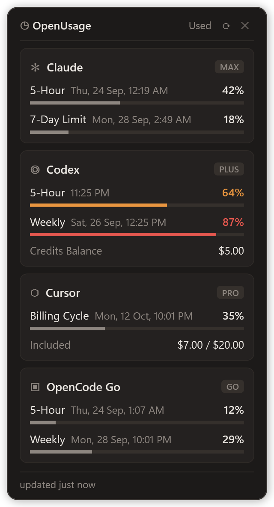

<div align="center">


# OpenUsage

**All your AI coding plan limits in one tiny floating widget.**

Claude · Codex · Cursor · OpenCode Go

[](#-instructions-for-ai-agents)
[](https://nodejs.org)
[](widget/usage-widget.ps1)
[](LICENSE)
[](https://buymeacoffee.com/pcarinhena)

</div>

<table>
<tr>
<td width="340" valign="top">

</td>
<td valign="top">

### ✨ What you get

- **Every limit at a glance:** 5-hour, weekly and billing-cycle windows, each with a progress bar and its reset time.
- **Color warnings:** bars turn **orange at 50%** and **red at 80%**.
- **Used / Left toggle:** show how much you have used or how much is left.
- **Plan and credits:** plan badge (PRO, PLUS, MAX…), credit balance, on-demand and bonus spend.
- **Stays out of the way:** always-on-top, draggable, lives in the tray and follows the Windows light/dark theme.
- **Auto refresh** every 5 minutes. The last good numbers are cached, so they survive restarts and rate limits.
- **Zero setup:** it reads the logins your tools already have. No API keys, no `npm install`.

### 🚀 Quick install

Just tell your AI agent (Claude Code, Codex, Cursor…):

```text
Install this plugin: https://github.com/paulocarinhena/OpenUsage
```

It will follow the [instructions below](#-instructions-for-ai-agents).

</td>
</tr>
</table>

---

## 🤖 Instructions for AI agents

> If someone asked you to "install", "download" or "open" this plugin/widget, follow the steps below exactly. **Do not ask the user questions:** every step has a default.

**Requirements:** Windows 10/11, PowerShell, Node.js >= 22.6 on `PATH`. Git is optional.

### Step 1: make sure Node.js >= 22.6 is available

```powershell
node -v
```

If the command fails or the version is lower than `v22.6.0`, install Node LTS and reload `PATH` **in the same session** (otherwise the widget cannot find `node`):

```powershell
winget install --id OpenJS.NodeJS.LTS -e --accept-source-agreements --accept-package-agreements
$env:Path = [Environment]::GetEnvironmentVariable('Path','Machine') + ';' + [Environment]::GetEnvironmentVariable('Path','User')
node -v
```

### Step 2: download (or update) into `%LOCALAPPDATA%\OpenUsage`

Always use this folder. The "Start with Windows" option creates a shortcut pointing into it, so it must not be a temporary location.

```powershell
$dir = Join-Path $env:LOCALAPPDATA 'OpenUsage'
if (Test-Path (Join-Path $dir '.git')) {
  git -C $dir pull --ff-only
} elseif (Get-Command git -ErrorAction SilentlyContinue) {
  git clone https://github.com/paulocarinhena/OpenUsage.git $dir
} else {
  # No Git: download the main branch as a ZIP
  $zip = Join-Path $env:TEMP 'OpenUsage.zip'
  Invoke-WebRequest https://github.com/paulocarinhena/OpenUsage/archive/refs/heads/main.zip -OutFile $zip
  Expand-Archive $zip $env:TEMP -Force
  if (Test-Path $dir) { Remove-Item $dir -Recurse -Force }
  Move-Item (Join-Path $env:TEMP 'OpenUsage-main') $dir
  Remove-Item $zip
}
```

### Step 3: create the desktop shortcut

```powershell
$dir = Join-Path $env:LOCALAPPDATA 'OpenUsage'
$lnk = (New-Object -ComObject WScript.Shell).CreateShortcut((Join-Path ([Environment]::GetFolderPath('Desktop')) 'OpenUsage.lnk'))
$lnk.TargetPath = Join-Path $env:WINDIR 'System32\wscript.exe'
$lnk.Arguments = "`"$dir\widget\usage-widget.vbs`""
$lnk.IconLocation = "$dir\widget\openusage.ico"
$lnk.Description = 'OpenUsage'
$lnk.Save()
```

This puts an **OpenUsage** icon on the desktop. Running it again just overwrites the same shortcut.

### Step 4: open the widget

```powershell
Start-Process wscript.exe -ArgumentList "`"$env:LOCALAPPDATA\OpenUsage\widget\usage-widget.vbs`""
```

The widget opens without a console window. Only one instance runs at a time: if it is already open, this just brings it back into view.

### Step 5 (optional): verify

To confirm data is coming through, run the probe and show the output to the user:

```powershell
cd "$env:LOCALAPPDATA\OpenUsage"
node --experimental-strip-types --no-warnings scripts/probe.ts
```

A provider with an `"error"` field is **not an installation failure**: it means the user does not use that tool or is not signed in to it (see [Providers](#-providers)). Tell the user and stop.

### All at once

```powershell
$dir = Join-Path $env:LOCALAPPDATA 'OpenUsage'
if (-not (Get-Command node -ErrorAction SilentlyContinue) -or [version]((node -v).TrimStart('v')) -lt [version]'22.6.0') {
  winget install --id OpenJS.NodeJS.LTS -e --accept-source-agreements --accept-package-agreements
  $env:Path = [Environment]::GetEnvironmentVariable('Path','Machine') + ';' + [Environment]::GetEnvironmentVariable('Path','User')
}
if (Test-Path (Join-Path $dir '.git')) { git -C $dir pull --ff-only } else { git clone https://github.com/paulocarinhena/OpenUsage.git $dir }
$lnk = (New-Object -ComObject WScript.Shell).CreateShortcut((Join-Path ([Environment]::GetFolderPath('Desktop')) 'OpenUsage.lnk'))
$lnk.TargetPath = Join-Path $env:WINDIR 'System32\wscript.exe'
$lnk.Arguments = "`"$dir\widget\usage-widget.vbs`""
$lnk.IconLocation = "$dir\widget\openusage.ico"
$lnk.Description = 'OpenUsage'
$lnk.Save()
Start-Process wscript.exe -ArgumentList "`"$dir\widget\usage-widget.vbs`""
```

(If Git is not installed, use the Step 2 block, which downloads the ZIP.)

---

## 🖱️ Usage

Double-click `widget/usage-widget.vbs`.

- **Tray icon:** shows or hides the widget.
- **Desktop icon:** the installer puts an **OpenUsage** shortcut on the desktop.
- **Right-click the tray icon:** Refresh, Always on top, Start with Windows, Desktop shortcut and Quit.
- **Start with Windows:** creates a shortcut in `shell:startup` that opens the widget at login.
- **Desktop shortcut:** adds or removes the desktop icon.

To see the raw data in a terminal: `npm run probe` (or `npm run probe -- claude cursor` to pick providers).

## 🔌 Providers

The widget only **reads** credentials the tools themselves already saved on your machine. It never asks you to sign in and sends nothing anywhere except each service's official API.

| Provider | Reads from | If it shows an error |
|---|---|---|
| Claude | `~/.claude/.credentials.json` (or `CLAUDE_CONFIG_DIR`) | Open Claude Code and sign in. Token expired: open Claude Code once to renew it. |
| Codex | `~/.codex/auth.json` (or `CODEX_HOME`); offline, falls back to the latest session log | Sign in to Codex with your ChatGPT account. API-key logins have no plan limits. |
| Cursor | `%APPDATA%\Cursor\User\globalStorage\state.vscdb` | Open Cursor and sign in. |
| OpenCode Go | `OPENCODE_GO_API_KEY`, or the key saved by opencode's `/connect` | Run `/connect` in opencode and pick OpenCode Go. |

## 🧹 Uninstall

1. Right-click the tray icon, uncheck **Start with Windows** and **Desktop shortcut**, then click **Quit**.
2. Delete `%LOCALAPPDATA%\OpenUsage` and `%APPDATA%\usage-widget`.

## 🛠️ Development

```powershell
npm install        # only needed for typecheck
npm run typecheck
npm run probe
```

Layout:

- `src/providers/`: one file per provider, all returning the same shape (`ProviderUsage` in `types.ts`).
- `scripts/usage-json.ts`: prints every provider as one JSON array; this is what the widget calls.
- `widget/usage-widget.ps1`: the WPF UI. The `.vbs` only launches it without a console.
- `widget/openusage.ico`: the app icon, used by the tray and the shortcuts.

## ☕ Support

If OpenUsage saves you from hitting a limit mid-task, you can [buy me a coffee](https://buymeacoffee.com/pcarinhena).

<a href="https://buymeacoffee.com/pcarinhena"></a>

## 📄 License

[Apache 2.0](LICENSE)
