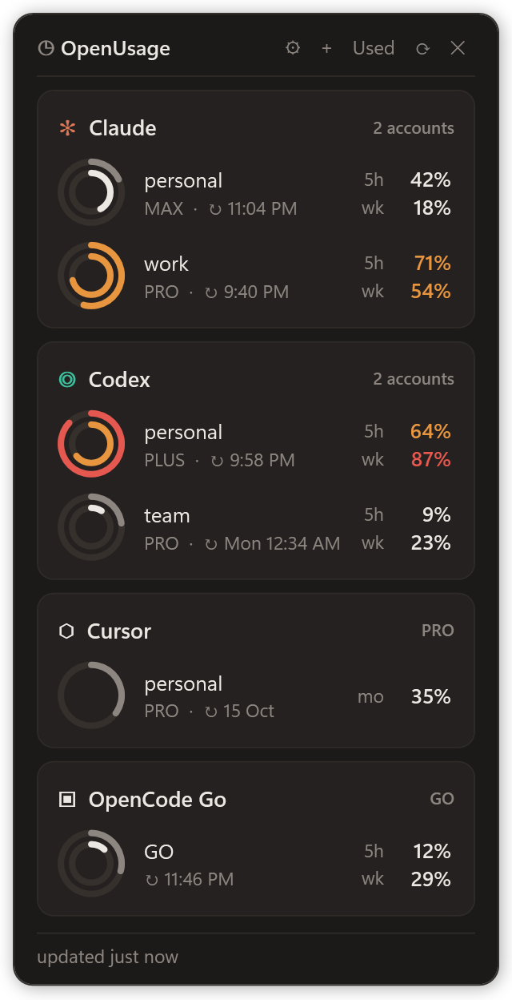
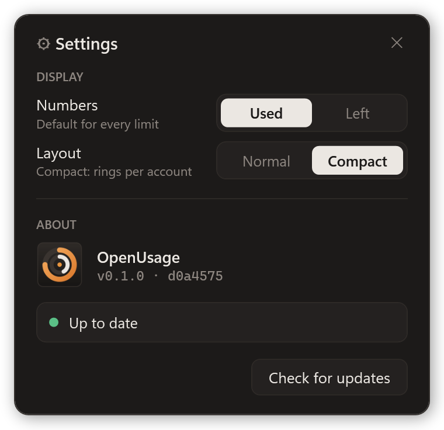
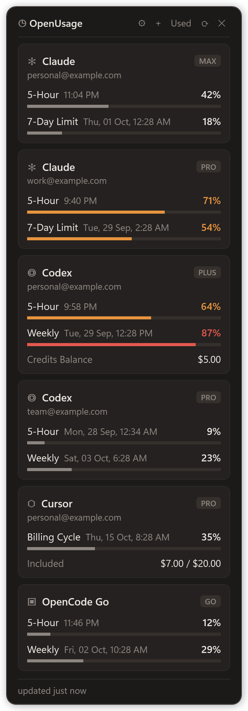

<div align="center">


# OpenUsage

**All your AI coding plan limits in one tiny floating widget.**

Claude · Codex · Cursor · OpenCode Go

[](#windows)
[](#macos)
[](https://nodejs.org)
[](widget/usage-widget.ps1)
[](widget-mac/OpenUsage.swift)
[](LICENSE)
[](https://buymeacoffee.com/pcarinhena)

</div>

<table>
<tr>
<td width="340" valign="top">

</td>
<td valign="top">

### ✨ What you get

- **Every limit at a glance:** 5-hour, weekly and billing-cycle windows, each with its reset time.
- **Two layouts:** **Compact** (above) gives each provider one card and each account one line: a double ring (outer = weekly, inner = 5 hours), the plan and next reset, and the 5h / weekly numbers. **Normal** shows every limit as a bar.
- **Multiple accounts:** two Claude or Codex logins side by side, added from the **+** button.
- **Color warnings:** rings and bars turn **orange at 50%** and **red at 80%**; a used-up limit is always a full red ring.
- **Used / Left:** show how much you have used or how much is left.
- **Settings and updates:** the **⚙** button picks the layout and Used/Left, shows the version and updates the widget in one click.
- **Plan and credits:** plan badge (PRO, PLUS, MAX…), credit balance, on-demand and bonus spend.
- **Stays out of the way:** always-on-top, draggable, lives in the tray (Windows) or menu bar (macOS) and follows the system light/dark theme.
- **Auto refresh** every 5 minutes. The last good numbers are cached, so they survive restarts and rate limits.
- **Zero setup:** it reads the logins your tools already have. No API keys, no `npm install`.
- **Windows and macOS.**

### 🚀 Quick install

Just tell your AI agent (Claude Code, Codex, Cursor…):

```text
Install this plugin: https://github.com/paulocarinhena/OpenUsage
```

It will follow the [instructions below](#-instructions-for-ai-agents).

</td>
</tr>
</table>

---

## 🤖 Instructions for AI agents

> If someone asked you to "install", "download" or "open" this plugin/widget, follow the steps below exactly. **Do not ask the user questions:** every step has a default.

> Check the operating system first: on **Windows** follow the steps right below; on **macOS** skip to [macOS](#macos).

### Windows

**Requirements:** Windows 10/11, PowerShell, Node.js >= 22.6 on `PATH`. Git is optional.

#### Step 1: make sure Node.js >= 22.6 is available

```powershell
node -v
```

If the command fails or the version is lower than `v22.6.0`, install Node LTS and reload `PATH` **in the same session** (otherwise the widget cannot find `node`):

```powershell
winget install --id OpenJS.NodeJS.LTS -e --accept-source-agreements --accept-package-agreements
$env:Path = [Environment]::GetEnvironmentVariable('Path','Machine') + ';' + [Environment]::GetEnvironmentVariable('Path','User')
node -v
```

#### Step 2: download (or update) into `%LOCALAPPDATA%\OpenUsage`

Always use this folder. The "Start with Windows" option creates a shortcut pointing into it, so it must not be a temporary location.

If the widget is already installed, this updates it. The first line closes a widget that is running: otherwise it keeps running the old version (only one instance runs at a time), and the ZIP path could not replace its folder.

```powershell
Get-CimInstance Win32_Process -Filter "Name='powershell.exe'" | Where-Object { $_.CommandLine -like '*usage-widget.ps1*' } | ForEach-Object { Stop-Process -Id $_.ProcessId -Force }
$dir = Join-Path $env:LOCALAPPDATA 'OpenUsage'
if (Test-Path (Join-Path $dir '.git')) {
  git -C $dir pull --ff-only
} elseif (Get-Command git -ErrorAction SilentlyContinue) {
  git clone https://github.com/paulocarinhena/OpenUsage.git $dir
} else {
  # No Git: download the main branch as a ZIP
  $zip = Join-Path $env:TEMP 'OpenUsage.zip'
  Invoke-WebRequest https://github.com/paulocarinhena/OpenUsage/archive/refs/heads/main.zip -OutFile $zip
  Expand-Archive $zip $env:TEMP -Force
  if (Test-Path $dir) { Remove-Item $dir -Recurse -Force }
  Move-Item (Join-Path $env:TEMP 'OpenUsage-main') $dir
  Remove-Item $zip
}
```

#### Step 3: create the desktop shortcut

```powershell
$dir = Join-Path $env:LOCALAPPDATA 'OpenUsage'
$lnk = (New-Object -ComObject WScript.Shell).CreateShortcut((Join-Path ([Environment]::GetFolderPath('Desktop')) 'OpenUsage.lnk'))
$lnk.TargetPath = Join-Path $env:WINDIR 'System32\wscript.exe'
$lnk.Arguments = "`"$dir\widget\usage-widget.vbs`""
$lnk.IconLocation = "$dir\widget\openusage.ico"
$lnk.Description = 'OpenUsage'
$lnk.Save()
```

This puts an **OpenUsage** icon on the desktop. Running it again just overwrites the same shortcut.

#### Step 4: open the widget

```powershell
Start-Process wscript.exe -ArgumentList "`"$env:LOCALAPPDATA\OpenUsage\widget\usage-widget.vbs`""
```

The widget opens without a console window. Only one instance runs at a time: if it is already open, this just brings it back into view (still on the version it started with), which is why Step 2 closes it first.

#### Step 5 (optional): verify

To confirm data is coming through, run the probe and show the output to the user:

```powershell
cd "$env:LOCALAPPDATA\OpenUsage"
node --experimental-strip-types --no-warnings scripts/probe.ts
```

A provider with an `"error"` field is **not an installation failure**: it means the user does not use that tool or is not signed in to it (see [Providers](#-providers)). Tell the user and stop.

#### All at once

```powershell
$dir = Join-Path $env:LOCALAPPDATA 'OpenUsage'
if (-not (Get-Command node -ErrorAction SilentlyContinue) -or [version]((node -v).TrimStart('v')) -lt [version]'22.6.0') {
  winget install --id OpenJS.NodeJS.LTS -e --accept-source-agreements --accept-package-agreements
  $env:Path = [Environment]::GetEnvironmentVariable('Path','Machine') + ';' + [Environment]::GetEnvironmentVariable('Path','User')
}
# Close a running widget, so an update starts on the new version.
Get-CimInstance Win32_Process -Filter "Name='powershell.exe'" | Where-Object { $_.CommandLine -like '*usage-widget.ps1*' } | ForEach-Object { Stop-Process -Id $_.ProcessId -Force }
if (Test-Path (Join-Path $dir '.git')) { git -C $dir pull --ff-only } else { git clone https://github.com/paulocarinhena/OpenUsage.git $dir }
$lnk = (New-Object -ComObject WScript.Shell).CreateShortcut((Join-Path ([Environment]::GetFolderPath('Desktop')) 'OpenUsage.lnk'))
$lnk.TargetPath = Join-Path $env:WINDIR 'System32\wscript.exe'
$lnk.Arguments = "`"$dir\widget\usage-widget.vbs`""
$lnk.IconLocation = "$dir\widget\openusage.ico"
$lnk.Description = 'OpenUsage'
$lnk.Save()
Start-Process wscript.exe -ArgumentList "`"$dir\widget\usage-widget.vbs`""
```

(If Git is not installed, use the Step 2 block, which downloads the ZIP.)

### macOS

**Requirements:** macOS 12+, Node.js >= 22.6, Xcode Command Line Tools (they provide `git` and `swiftc`; the app is compiled on the Mac, so there is no unsigned download for Gatekeeper to block).

#### Step 1: make sure the tools are there

```bash
xcode-select -p >/dev/null 2>&1 || xcode-select --install   # opens Apple's installer; wait for it to finish
node -v
```

If `node` is missing or older than `v22.6.0`, install it with Homebrew (`brew install node`) or from [nodejs.org](https://nodejs.org).

#### Step 2: download (or update), build and open

Always use `~/Library/Application Support/OpenUsage`: the app reads the scripts from there.

```bash
dir="$HOME/Library/Application Support/OpenUsage"
if [ -d "$dir/.git" ]; then git -C "$dir" pull --ff-only; else git clone https://github.com/paulocarinhena/OpenUsage.git "$dir"; fi
"$dir/widget-mac/build.sh"
open "$HOME/Applications/OpenUsage.app"
```

`build.sh` compiles the widget into `~/Applications/OpenUsage.app` (findable in Spotlight and Launchpad). Run it again after every update.

The first time the Claude provider runs, macOS may ask whether `security` can read the **Claude Code-credentials** Keychain item: that is where Claude Code keeps its login on macOS. Click **Always Allow**.

#### Step 3 (optional): verify

```bash
cd "$HOME/Library/Application Support/OpenUsage"
node --experimental-strip-types --no-warnings scripts/probe.ts
```

As on Windows, a provider with an `"error"` field only means the user does not use that tool or is not signed in.

---

## 🖱️ Usage

### Header buttons

| Button | What it does |
|---|---|
| **⚙** | Settings (below). A dot on it means an update is waiting. |
| **+** | Adds another Claude or Codex account (see [Multiple accounts](#multiple-accounts)). |
| **Used / Left** | Flips every number between used and left. |
| **⟳** | Refreshes now (it also refreshes every 5 minutes). |
| **✕** | Hides the widget; the tray / menu bar icon brings it back. |

### Reading the compact layout

```text
 ◔  paulo            5h   39%     outer ring  weekly limit (or the billing cycle)
    PRO · ↻ 00:19    wk   19%     inner ring  5-hour limit
```

- **↻** is when the 5-hour limit resets (or the weekly one, when there is no 5-hour limit).
- Colors follow the used share: **orange** from 50%, **red** from 80%. A used-up limit is a **full red ring** in both Used and Left.
- Providers you are not signed in to are left out; the Normal layout shows them with a hint on how to sign in.
- An account whose login needs attention (expired token, say) shows **!** and the reason.

Hover a line to see every limit with its reset time, the plan and any error.

### Settings



- **Numbers:** **Used** or **Left**, the default for every limit.
- **Layout:** **Compact** (a card per provider, a line per account: the ring, the plan and next reset, then the 5h / weekly numbers) or **Normal** (a card per account with a bar per limit). Compact leaves out providers you are not signed in to; Normal keeps them with a hint on how to sign in. A used-up limit is always a full red ring, even when showing what is left.
- **About:** the version and commit in use. The widget looks for a new version when it starts and once a day. **Update now** pulls it (`git pull --ff-only`) and restarts the widget; on macOS the app is rebuilt first. A copy installed from the ZIP (without Git) can't update itself: download it again.

<details>
<summary>Normal layout</summary>



</details>

### On Windows

Double-click `widget/usage-widget.vbs`.

- **Tray icon:** shows or hides the widget.
- **Desktop icon:** the installer puts an **OpenUsage** shortcut on the desktop.
- **Right-click the tray icon:** Refresh, Settings, Add account, Always on top, Start with Windows, Desktop shortcut and Quit.
- **Start with Windows:** creates a shortcut in `shell:startup` that opens the widget at login.
- **Desktop shortcut:** adds or removes the desktop icon.

### On macOS

Open **OpenUsage** from Spotlight, Launchpad or `~/Applications`.

- **Menu bar icon:** Show / hide, Refresh, Settings…, Add account…, Always on top, Start at login and Quit.
- **Drag the header** to move the widget; it remembers where you left it.
- **Start at login:** adds a LaunchAgent (`~/Library/LaunchAgents/com.openusage.widget.plist`) that opens the app at login.

To see the raw data in a terminal: `npm run probe` (or `npm run probe -- claude cursor` to pick providers). To check for or apply an update from a terminal: `node --experimental-strip-types scripts/update.ts check` (or `apply`), or just `git pull`.

## 🔌 Providers

The widget only **reads** credentials the tools themselves already saved on your machine. It never asks you to sign in and sends nothing anywhere except each service's official API.

| Provider | Reads from | If it shows an error |
|---|---|---|
| Claude | `~/.claude/.credentials.json` (or `CLAUDE_CONFIG_DIR`); on macOS, the Keychain item Claude Code saves | Open Claude Code and sign in. Token expired: open Claude Code once to renew it. |
| Codex | `~/.codex/auth.json` (or `CODEX_HOME`); offline, falls back to the latest session log | Sign in to Codex with your ChatGPT account. API-key logins have no plan limits. |
| Cursor | `%APPDATA%\Cursor\User\globalStorage\state.vscdb`, or `~/Library/Application Support/Cursor/User/globalStorage/state.vscdb` on macOS | Open Cursor and sign in. |
| OpenCode Go | `OPENCODE_GO_API_KEY`, or the key saved by opencode's `/connect` | Run `/connect` in opencode and pick OpenCode Go. |

### Multiple accounts

Claude Code and Codex keep one login per config folder, so each extra account gets its own folder in your home (`.claude-2`, `.codex-work`…) and a command that opens it, like `claude2`. The widget finds these folders and shows one card per account.

- **Windows and macOS:** click **+** in the widget header (or **Add account** in the tray / menu bar menu), pick a command name and sign in with the other account in the terminal that opens.
- **Linux, or any terminal:**

  ```bash
  npm run add-account -- claude claude2   # then sign in and type /exit
  npm run add-account -- codex codex2     # signs in through the browser
  ```

After that, `claude` opens your main account and `claude2` the other one, in any terminal (the same goes for `codex` / `codex2`). The command lives next to `claude` on Windows and in `~/.local/bin` elsewhere. If nothing was signed in, or the browser signed in to your main account again, the new folder and command are removed; sign out in the browser (or use a private window) and try again.

Claude tokens are only renewed by Claude Code itself, so open `claude2` now and then to keep its card fresh. To remove an account, delete its folder and command.

## 🧹 Uninstall

**Windows**

1. Right-click the tray icon, uncheck **Start with Windows** and **Desktop shortcut**, then click **Quit**.
2. Delete `%LOCALAPPDATA%\OpenUsage` and `%APPDATA%\usage-widget`.

**macOS**

1. In the menu bar icon, uncheck **Start at login**, then click **Quit**.
2. Delete `~/Applications/OpenUsage.app`, `~/Library/Application Support/OpenUsage` and `~/Library/Application Support/usage-widget`.

## 🛠️ Development

```powershell
npm install        # only needed for typecheck
npm run typecheck
npm run probe
```

Layout:

- `src/providers/`: one file per provider, all returning the same shape (`ProviderUsage` in `types.ts`).
- `scripts/usage-json.ts`: prints every provider as one JSON array; this is what the widget calls.
- `scripts/update.ts`: the version, and the self-update behind **Update now** (`check` / `apply`).
- `scripts/add-account.ts`: adds another Claude or Codex account (folder, command, sign-in); the widgets' **+** button runs it.
- `widget/usage-widget.ps1`: the WPF UI. The `.vbs` only launches it without a console.
- `widget/openusage.ico`: the app icon, used by the tray and the shortcuts.
- `widget-mac/OpenUsage.swift`: the macOS app (AppKit + SwiftUI). `widget-mac/build.sh` compiles it into `OpenUsage.app`.

## ☕ Support

If OpenUsage saves you from hitting a limit mid-task, you can [buy me a coffee](https://buymeacoffee.com/pcarinhena).

<a href="https://buymeacoffee.com/pcarinhena"></a>

## 📄 License

[Apache 2.0](LICENSE)
